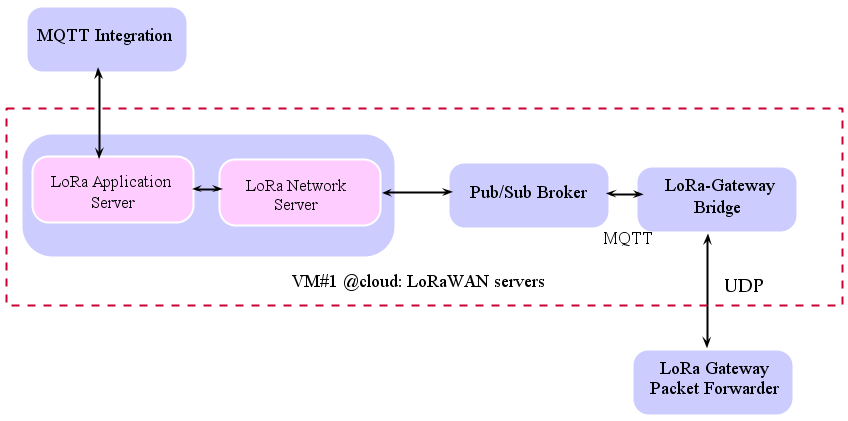

****************************************
## <p align="center"> LoRaWAN Communication protocol </p>
****************************************


 ## Getting Started
The following installation and administration guides cover the LoRaWAN network.

LoRaWAN networks can be used in two ways:

• Using online services such as **the Things Network (TTN)** which offers a set of open tools to get up and run LoRaWAN:

https://www.thethingsnetwork.org/

• We can create our own private LoRaWAN network by using the **LoRa Server project components**.


In the following, we will install and congifure the open source LoRaWAN ChirpStack project on our local machine for development and testing purposes.


 ## Contents
 
- [## Software Requirements](#h2-id%22software-requirements-8%22software-requirementsh2)
  - [Mosquitto Installation](#mosquitto-installation)
  - [LoRa Server Implementation](#lora-server-implementation)
    - [LoRa-Gateway Bridge](#lora-gateway-bridge)
      - [<font color='red'>Installation</font>](#font-colorredinstallationfont)
      - [<font color='red'>Configuration</font>](#font-colorredconfigurationfont)
      - [<font color='red'>Starting</font>](#font-colorredstartingfont)
    - [LoRa Network Server](#lora-network-server)
      - [<font color='red'>Prerequis installation</font>](#font-colorredprerequis-installationfont)
      - [<font color='red'>Install LoRa Network Server</font>](#font-colorredinstall-lora-network-serverfont)
      - [<font color='red'>Starting LoRa Network Server</font>](#font-colorredstarting-lora-network-serverfont)
    - [LoRa Application Server](#lora-application-server)
      - [<font color='red'>Sotware Requirements</font>](#font-colorredsotware-requirementsfont)
      - [<font color='red'>Install LoRa Application Server</font>](#font-colorredinstall-lora-application-serverfont)
      - [<font color='red'>Starting LoRa Application Server</font>](#font-colorredstarting-lora-application-serverfont)
  - [Connect LoRaWAN Gateway/Node to ChirpStack](#connect-lorawan-gatewaynode-to-chirpstack)
      - [Connect Gateway to LoRa Server](#connect-gateway-to-lora-server)
      - [Connect Device Node to LoRa Server](#connect-device-node-to-lora-server)


## LoRa Server project
<p style='text-align: justify;'> 
The LoRa Server open-source LoRaWAN Network Server stack provides open-source components for LoRaWAN networks. Together they form a ready-to-use solution including a user-friendly web-interface for device management and APIs for integration. The modular architecture makes it possible to integrate within existing infrastructures. All components are licensed under the MIT license and can be used for commercial purposes. It supports Class A, Class B, and Class C modes, as well as adaptive data-rate, live-frame logging, channel configuration, multi-tenant, APIs and integration, etc.</p>


- The LoRa Server project consists of four major components: 

**-LoRa Gateway Bridge:**  abstracts the packet forwarder UDP protocol data into JSON and sends it to the LoRa Server over MQTT.
   
**-LoRa Network Server:** is the LoRaWAN network server. It de-duplicates and handles the received uplink frames from
the gateway(s), handles the LoRaWAN mac layer and schedules the downlink data transmissions.

**-LoRa Application Server:** is the LoRaWAN Application Server and handles the join-requests, encryption ofapplication payloads and offers a RESTful JSON API, gRPC API or MQTT for external services. 

To visualize the received sensor data and manage the applocations, LoRa server provides a web interface.


**-LoRa Geolocation Server:** is an optional component which integrates with multiple LoRaWAN geolocation backends.

The LoRa Geo Server will not be discussed in this tutorial.


## Considered LORa Server architecture

All LoRa Server components and their dependencies will be installed on the same own server as shown in the following graph.

<p align="center"> </p>

## Software Requirements
===========

Linux Ubuntu 18.04 LTS.
Mosquitto MQTT broker
PostgreSQL database
Redis database

===========
## Mosquitto Installation

```ruby
sudo apt update
sudo apt install mosquitto mosquitto-clients
 ```

<p style='text-align: justify;'> 
The LoRa Server project provides pre-compiled binaries packaged as Debian (.deb) packages. In order to activate this repository, execute the following commands:</p>

```ruby
sudo apt install apt-transport-https dirmngr
sudo apt-key adv --keyserver keyserver.ubuntu.com --recv-keys 1CE2AFD36DBCCA00
sudo echo "deb https://artifacts.loraserver.io/packages/2.x/deb stable main" | sudo tee /etc/apt/sources.list.d/loraserver.list
sudo apt-get update 
 ```


## LoRa Server Implementation 

### LoRa-Gateway Bridge 
#### <font color='red'>Installation</font>


Install LoRa Gateway Bridge as 
```ruby
 sudo apt-get install lora-gateway-bridge  
```
  #### <font color='red'>Configuration</font>
- Modify LoRa Gateway Bridge configuration file
<font color='pink'> /etc/lora-gateway-bridge/lora-gateway-bridge.toml.</font>
```ruby
sudo su 
cd /etc/lora-gateway-bridge
nano lora-gateway-bridge.toml 
```
- Make the following changes (if needed):
<font color='blue'>server="tcp://127.0.0.1:1883" 
Note: server
MQTT broker address and port 
Type: exit (After changes)
</font>


#### <font color='red'>Starting</font>
```ruby
sudo systemctl start lora-gateway-bridge 
systemctl status lora-gateway-bridge 
```
- Start Lora-gateway-bridge on boot.
```ruby
sudo systemctl enable lora-gateway-bridge 
```


### LoRa Network Server
#### <font color='red'>Prerequis installation</font>

- Install PostgreSQL.
```ruby
sudo apt-get install postgresql 
```
- Install Redis server.
```ruby
sudo apt-get install redis-server 
```

- LoRa Network Server needs its own database. To create a new database, start the PostgreSQL prompt as the postgres user.
```ruby
sudo -u postgres psql 
```
- Within the PostgreSQL prompt, enter the following queries (Note: The database password is: '**loradbpassword**'):


1- create the chirpstack_ns user with password 'loradbpassword'
```ruby
create role loraserver_ns with login password 'loradbpassword';
```
2- create the loraserver_ns database
```ruby
create database loraserver_ns with owner loraserver_ns;
```
3- exit the prompt
```ruby
\q
```

- Verify if the user and database have been setup correctly, try to connect to it:
```ruby
psql -h localhost -U loraserver_ns -W loraserver_ns
\q 
```


#### <font color='red'>Install LoRa Network Server</font>

- Execute the following command to install LoRa Server:
```ruby 
sudo apt-get install loraserver
```

After installation, modify the configuration file which is located at 
- LoRa Network sever configuration file is installed at <font color='pink'>
  /etc/loraserver/loraserver.toml.
  </font>
- LoRa Network Server executable is installed at <font color='pink'>
   /usr/bin/loraserver
</font>

- Modify the LoRa Network Server configuration file <font color='pink'> /etc/loraserver/loraserver.toml.</font>
 
 ```ruby
    sudo su 
    cd /etc/loraserver 
    nano loraserver.toml 
 ```

- Make the following changes (if needed):

 <font color='blue'>
dsn="postgres://loraserver_ns:loradbpassword @localhost/chirpstack_ns?sslmode=disable" 
automigrate=true
name="EU_863_870"
timezone="Local"
server="tcp://127.0.0.1:1883"
 </font>

#### <font color='red'>Starting LoRa Network Server</font>
- Start LoRa Network Server.
 ```ruby
sudo systemctl start loraserver 
sudo systemctl stop loraserver
sudo systemctl restart loraserver
sudo systemctl status loraserver
 ```

 - Start LoRa Network Server on boot.
 ```ruby
sudo systemctl enable loraserver
 ```

### LoRa Application Server
 
#### <font color='red'>Sotware Requirements</font>
- LoRa Application Server persists the gateway data into a PostgreSQL database.
LoRa Application Server needs its own database. To create a new database, start the PostgreSQL prompt as the postgres user:
 ```ruby
sudo -u postgres psql 
 ```
- Within the PostgreSQL prompt, enter the following queries: 

1- create the loraserver_as user
 ```ruby
create role loraserver_as with login password 'loradbpassword';
 ```
2- create the loraserver_as database
 ```ruby
create database loraserver_as with owner loraserver_as;
 ```
2- enable the trigram and hstore extensions
 ```ruby
\c chirpstack_as
create extension pg_trgm;
create extension hstore;
 ```
3- exit the prompt
 ```ruby
\q
 ```

- Verify if the user and database have been setup correctly, try to connect to it
 ```ruby
psql -h localhost -U loraserver_as -W loraserver_as
 \q 
 ```
 #### <font color='red'>Install LoRa Application Server</font>
```ruby
sudo apt-get install lora-app-server
```

- LoRa Application Server configuration file is installed at <font color='pink'>
  /etc/lora-app-server/lora-app-server.toml.
  </font>
- LoRa Application Server executable is installed at <font color='pink'>
 /usr/bin/lora-app-server
 </font>


- Create a JSON Web Token (jwt). Open a terminal.
```ruby
openssl rand -base64 32
```
<font color='blue'>
 Result: 0FTIjnMh+0bWgl5d4csdZ5yIdHnrVQAg0lOgFg/+lSw=
</font>


- Modify the ChirpStack Application Server configuration file <font color='pink'>
  /etc/lora-app-server/lora-app-server.toml.
  </font>
```ruby
sudo su 
cd /etc/lora-app-server
nano lora-app-server.toml 
```
- Make the following changes (if needed):
<font color='blue'> 
dsn="postgres://loraserver_as:loradbpassword@ localhost/chirpstack_as?sslmode=disable"
jwt_secret="e3+eD7zcVFJF3EFpPnM1oMj02DqUZxt5wR4IfPBpbtA="
server="tcp://localhost:1883"
public_host="localhost:8001" 
</font>
 **Explication** 
<font color='blue'>
Note 1: dsn
Given you used the password dbpassword when creating the PostgreSQL database.
Note 2: jwt_secret
jwt_secret, see step 6.
Note 3: server
MQTT broker address and port
Note 4: public_host
</font>
The Internal API Server is used by LoRa Network Server to communicate with LoRa Application Server 

  #### <font color='red'>Starting LoRa Application Server</font>

```ruby
sudo systemctl start lora-app-server
sudo systemctl enable lora-app-server
```


- check it: Check if all required services are running 
```ruby 
systemctl status ttn-gateway
systemctl status mosquitto 
systemctl status lora-gateway-bridge
systemctl status loraserver
systemctl status lora-app-server
```


## Connect LoRaWAN Gateway/Node to ChirpStack
#### Connect Gateway to LoRa Server
- Add Gateway profile
- Add Gateway
-  You could check the details of gateway after adding Gateway.
**Note**: If GPS data is not seen, please check if you install GPS antenna and put gateway at a place with strong signal
#### Connect Device Node to LoRa Server
- . Add Device-profile


