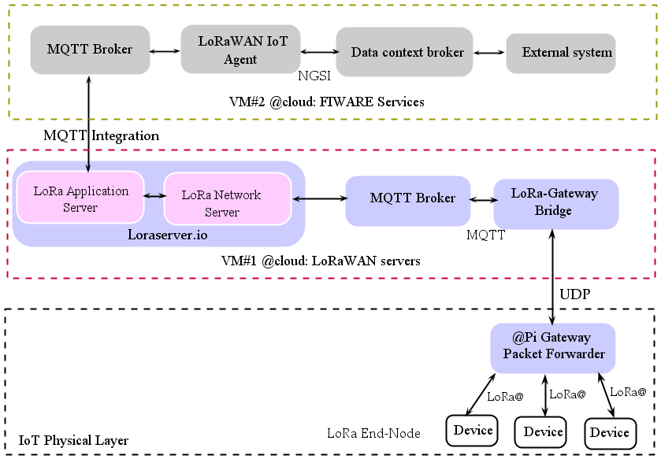

****************************************
## 
  LoRaWAN based IoT Solution for Resource Water Mangement

****************************************

## Introduction

 Take water level in wells as an instance, monitoring and measuring the level with IoT-based system will protect users from running into serious problems such as water outages. The gateways, submersible-type sensors and other items establish a network that can be highly-secure, responsive and conducive to data transmission, value measurement, and timely alert. Users can identify and diagnose well production issues in the first place.
 By adopting water level monitoring based IoT solution, user from anywhere and anytime, can have a better understanding of how the well performs when the pump is running the most. 

## Description 

 In this work, we propose an IoT achitecture capable of covering the Mornag watershed region, in order to monitor and control the avaible water volumes. A smart IoT agriculture application, bringing innovative solutions, is implemented to predict irrigation water requireements thus improving the management of the use of water resources. In particular, FIWARE IoT Agent for LoRaWAN protocol, enabling data and commands to be exchanged between IoT devices and FIWARE NGSI Context Brokers using LoRaWAN protocol is used in this work.

 
LoRaWAN is an open Low Power Wide Area Network (LPWAN) standard developed by LoRa Alliance and has key features i.e., low power consumption, long-range communication, end-to-end security, mobility and localization services.
LoRaWAN network topology is considered as star-of-stars and from        the architectural point of view, the system has three main components: network servers, gateways (GWs) and end nodes. End nodes communicate with the network server via GWs and Node-to-GW communication can be either LoRa or FSK modulation with different data rates and channels. Network servers manage the GWs through standard IP technology and data frames sent through end nodes, received by GWs and routed through the network server until acheiving the FIWARE platform via  integration.

## IoT Architecture
Here's the global adopted IoT architecture using FIWARE LoRaWAN IoT agent platform to manage LoRA device payloads.

 

The diagram above presents the adopted IoT system which is summurised in three blocks. 
- **Data acquisition and transmission**
   * End nodes, equipped by RF LoRa module, are in sleep mode until a given time where it wakes up, sends the data to the gateway. 
   * LoRa packet forwarder protocol is running on the host of a LoRa gateway that forwards RF packets received by the gateway to a server through UDP communication, and emits RF packets that are sent by the server.
- **Sending data to LoRa Server**
    * A LoRa Gateway Bridge service is used to abstract the packetforwarder UDP protocol into JSON over MQTT and will forward it to the LoRa network server that will send it to the application server. 
- **FIWARE IoT agent**
  * Once the data has been correctly sent to the Lora application server, this latter will start decoding it and will then hand it over an MQTT broker that will relay it to Fiware’s IoT agent. At this point, the data will be converted into NGSI and forwarded to Fiware’s orion context broker.

## Directory layout
Installation guides, configuration files and source codes are presented in the following links

   [End-Nodes  and gateway for IoT physical layer](Devices) 

  [LoRaWAN protocol communication](LORAWAN.md) 

  [FIWARE IoT Agent for LoRaWAN protocol](Fiware)