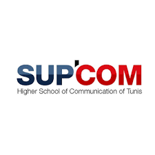
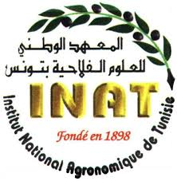
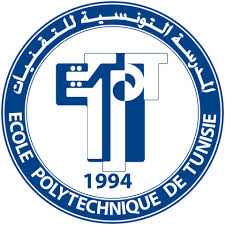

## <p align="center"> Smart Water Management: Development of a Real-Time System for Water Resources Management: Study of Mornag Basin </p>

<p style='text-align: justify;'>  It is about a Tunisian PNRI (Programme National de Recherche et d’Innovation) project which is a crossing and collaboration which brings together public research partners with industrial partners. This project aims at deploying an IoT smart agriculture application used to predict irrigation water requirements. The aim is to offer irrigation programs according to the needs and available water volumes.
</p>


## Project Identification and Presentation
The PNRI project is a collaboration between 

 
|  <ul> **Project staff**  | <ul> **Partners** 
| :--- | :--- |
|  <ul> **Leader and coordination**  | <ul> CERT (Centre d’Etudes et de Recherche des Télécommunications)     </ul>   
 | <ul> **Public research partners**  | <ul> <li>SUPCOM (Ecole Supérieure des Communications de Tunis </li> <li>INAT (Institut National Agronomique de Tunisie) </li> <li>EPT (Ecole Polytechnique de Tunisie)  </li> </ul>  
 | <ul> **Industrial partners**  | <ul> <li>Telecom provider Ooredoo </li> <li> IPNET  </li> </ul>  


 


## Project Description 

### Brief Description 
<p style='text-align: justify;'> 
Tunisia's climate is Mediterranean in the north, with mild rainy winters and hot, dry summers. The south of the country is a sub-Saharan-type zone. The water resources are rather complex and are characterized by a diversity of water resources used: surface water, groundwater, and treatment wastewater. These resources are mainly used for irrigation and, to a lesser degree, for the drinking water supply in rural areas of the region. The use of these resources is provided by a complex hydraulic network consisting of pumping stations,  storage tanks, transfer and distribution canals and pipelines.

<p style='text-align: justify;'> 
In addition to the authorities' desire to build dams and basins to mobilize surface water and alleviate the pressure on underground resources, it is essential to promote the use of new instrumentation technologies, data transport and information processing to better manage water resources. The main goal of the PNRI project is to deploy a smart system based Internet of Things (IoT) technology for an optimal walter resource exploitation and distribution. More precisely,  a LoRa IoT network is used to collect measured data. These data will be used to feed a water consumption predictive model.
<p style='text-align: justify;'> 
The PNRI project choose the Mornag watershed as a living laboratory. This watershed covers about 400 hectares and comprises the majority of water resources in the “El Hma” basin, deep and semi-deep aquifers, the Medjerda canal and various watercourses.
<p style='text-align: justify;'> 
The innovation brought about by this project lies mainly in the following aspects:

* Design, prototyping and realization of sensors to measure water level in canals, pressure in pipes, soil humidity and climatic data. It is planned to deploy a large number sensor nodes.
 
* <p style='text-align: justify;'> Limiting the deployment cost will be one of the challenges of the project (low cost IoT devices wit better precision): improvement measurement techniques by optimizing the sensors manufacturing and marketing costs. 

* <p style='text-align: justify;'>  Exploit the aggregated data: the measured data are analyzed and conditioned to obtain more precision by the data science system:
     
     * <p style='text-align: justify;'>  Evaluation of water availability estimates and predictions models based on real data
     * <p style='text-align: justify;'>  Exploitation of massive measurements and comparison with models, in the sense of adjusting them and improving the provisional water management policy.

</p>

### Significance/Impact: Target Beneficiaries
<p style='text-align: justify;'> 
Government agencies (National Irrigation Administration, Department of Agriculture- Regional Field Units, local government units), policy makers, researchers, engineers and scientists,  academic institutions, non-government organizations (irrigator’s associations, farmers association), private sector.
</p>

## Project Directory Structure

````
├── WP1: 
│   ├── EndN-Node
│     ├── WP111
|     ├── WAP112
│   ├── Packet Forward Gateway
│     ├── WP121
|     ├── WP122
│   ├── Fiware Plateform
│       ├── 
|           |──
|           |──
|           |──
|       ├── 
|           |──
|           |──
|           |──
├── WP2
├── WP4
├── WP5 
|── WP6
````

## Parteners links

[](http://www.supcom.mincom.tn/Fr/accueil_46_3)   [](http://www.inat.tn/fr)
[](https://univ-internationale.com/fr/partenairele-centre-d%E2%80%99etudes-et-de-recherche-des-t%C3%A9l%C3%A9communications-cert)    [](http://www.ept.rnu.tn/)   

[](https://www.ooredoo.tn/)  [](http://www.supcom.mincom.tn/Fr/accueil_46_3)   
 
 